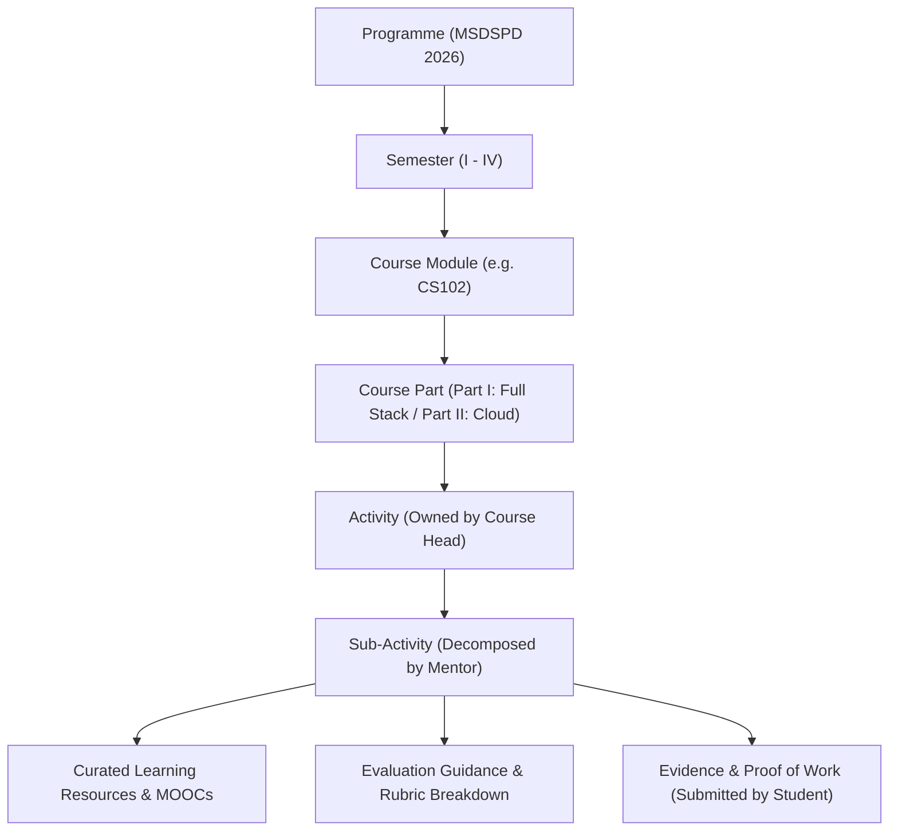
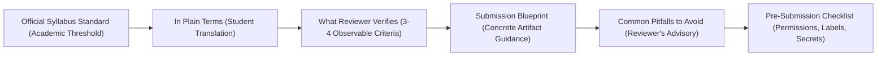

# Activity and Sub-Activity Fields Explanation

**Programme:** M.Sc. Data Science and Product Development (MSDSPD 2026 Batch)  
**System:** MSDSPD Applied Learning Portal (`msdspd-course-2026`)  
**Document Type:** Field Reference & Technical Specification  
**Related Documents:** [`docs/MSc-DS-Product-Development-Course-Plan.md`](./MSc-DS-Product-Development-Course-Plan.md), [`docs/SIMPLE_TERMINOLOGY_LEARNING_GUIDE.md`](./SIMPLE_TERMINOLOGY_LEARNING_GUIDE.md)

---

## 1. Overview and Structural Hierarchy

In the MSDSPD framework, learning is structured hierarchically from programme governance down to executable student tasks:

- **Activity (`<COURSE>-ACT-xx`)**: An official, course-mapped workplace brief created and governed by the **Course Head**. It defines *what* professional problem needs solving, *which* course outcomes are targeted, its indicative hours/marks weighting, and *how* work will be evaluated.
- **Sub-Activity (`SUB-x.x`)**: An operational, ordered engineering work item created and sequenced by the **Assigned Mentor**. It decomposes the Activity into concrete, sequential deliverables with curated resources, measurable evidence, and observable grading standards.
- **Evaluation Guidance**: A student-friendly translation layer in the portal that operationalizes formal academic standards into clear, observable criteria, submission blueprints, and common pitfalls to avoid.

---

## 2. Activity Fields (Course Head Boundary)

The Activity represents an authentic workplace project slice. Its fields govern academic validity, syllabus alignment, and client-style deliverables.

### Active Portal Implementation (`lib/types.ts` & `lib/courses/cs102.ts`)

| Field Name | Type | Owner | Purpose & Description | Allowed Values / Format | Practical Example (from CS102) |
|---|---|---|---|---|---|
| `id` | String | Course Head | Unique formal identifier prefixed by the course code. | `<COURSE>-ACT-<XX>` | `"CS102-ACT-01"` |
| `part` | `"I"` \| `"II"` | Course Head | Architectural domain or module split within the course. | `"I"`, `"II"` | `"I"` (Part I — Full Stack Architecture) |
| `icon` | Enum | Course Head | Visual domain category icon for the activity card. | `"frontend"`, `"backend"`, `"database"`, `"integration"`, `"cloud"` | `"frontend"` |
| `hours` | Number | Course Head | Total indicative learning hours, doubling as the mark weight. | Positive integer | `22` (22 hours / 22 marks) |
| `title` | String | Course Head | Professional name of the brief or engineering capability. | Title-case string | `"Frontend Application Engineering"` |
| `desc` | String | Course Head | Concise summary of the workplace problem and technical focus. | Single-line summary | `"Accessible, responsive UI on your chosen framework, wired to the API contract."` |
| `outcome` | String | Course Head | The specific Course Outcome (CO) or exit competency achieved. | Measurable outcome statement | `"Build an accessible, responsive, framework-based frontend that consumes an API contract with correct interface states."` |
| `subs` | Array<`SubActivity`> | Mentor / Course Head | Ordered list of decomposed sub-activities forming this activity. | Array of sub-activity objects | *7 sub-activities for ACT-01* |

### Extended Governance Attributes (Curriculum Management)

When managed in academic planning systems, Activities also track the following institutional attributes:

| Governance Field | Purpose & Description | Format / Example |
|---|---|---|
| `courseCode` | Associated credit-bearing academic course code. | `"CS102"` |
| `courseTitle` | Full academic course title. | `"Full Stack Architecture & Cloud-Native Development"` |
| `semester` | Academic semester within the 2-year MSDSPD programme. | `"Semester 1"` |
| `ltp` | Lecture–Tutorial–Practical credit distribution. | `"1–0–3"` (4 Credits) |
| `mandatoryDeliverables` | Mandatory list of artifacts required to clear the evaluation gate. | `"Versioned repository, openapi.yaml, ER diagram, passing CI run."` |
| `technicalConstraints` | Mandatory engineering, architectural, and security boundaries. | `"OpenAPI 3.1, PostgreSQL 16, WCAG 2.2 accessibility, RFC 9457."` |

---

## 3. Sub-Activity Fields (Mentor & Execution Boundary)

Sub-activities break the parent Activity into actionable, chronological engineering steps. They define exactly what the student executes, submits, and proves.

### Active Portal Implementation (`lib/types.ts`)

| Field Name | Type | Owner | Purpose & Description | Allowed Values / Format | Practical Example |
|---|---|---|---|---|---|
| `id` | String | Mentor | Local hierarchical code matching `<ActivityNum>.<StepNum>`. | `"1.1"`, `"1.2"`, `"2.4"`, etc. | `"1.2"` |
| `title` | String | Mentor | Action-oriented title describing the concrete engineering task. | Concise title string | `"Semantic HTML and accessible forms"` |
| `hours` | Number | Mentor | Estimated learning effort in hours (also equals individual mark weight). | Positive integer | `3` (3 hours / 3 marks) |
| `tag` | `ThinkingSkill` | Mentor | Primary cognitive skill tier practiced in this task (Bloom-aligned). | **6 Thinking Skills** (see Section 4) | `"Apply Principles"` |
| `evidence` | String | Mentor | The exact tangible artifact or proof of work the student submits. | Concrete deliverable string | `"Semantic page, validated form and accessibility-check report."` |
| `standard` | String | Course Head / Mentor | The operationalized **"Meets standard"** baseline grading threshold. | Objective grading threshold | `"Uses appropriate landmarks, labels, input types, validation messages and keyboard access per WCAG 2.2."` |
| `resources` | Array<String> | Mentor | Array of resource IDs resolved against the course `RESOURCES` catalog. | Valid resource keys (`"R01"`, `"M01"`, etc.) | `["R02", "R03"]` |

---

## 4. Thinking-Skill Taxonomy (Jargon-Free Bloom Mapping)

The portal avoids confusing educational terminology by using student-friendly, action-oriented **Thinking Skills**:

| Thinking Skill | Formal Bloom Tier | What the Student Does | UI Badge Style | Practical Example |
|---|---|---|---|---|
| **Recall Fundamentals** | *Remember* | Recalls standard terms, HTTP methods, DNS flow, and syntax rules accurately. | Slate (`bg-slate-50 text-slate-700`) | Request lifecycle diagram and network trace (`SUB-1.1`). |
| **Understand Core Ideas** | *Understand* | Grasps the "why" and explains how components connect in realistic scenarios. | Sky (`bg-sky-50 text-sky-700`) | Cloud shared responsibility model and IAM boundaries (`SUB-5.1`). |
| **Apply Principles** | *Apply* | Uses established design patterns and tools to solve an isolated problem. | Indigo (`bg-indigo-50 text-indigo-700`) | Implementing modern JS modules, async workflows, and tests (`SUB-1.4`). |
| **Analyse the Problem** | *Analyze* | Investigates root causes, profiles performance, and identifies risks. | Amber (`bg-amber-50 text-amber-700`) | Query optimization using EXPLAIN ANALYZE before/after plans (`SUB-3.7`). |
| **Review and Justify** | *Evaluate* | Evaluates trade-offs, critiques code, defends architectural choices under review. | Violet (`bg-violet-50 text-violet-700`) | Live demonstration defending rollback and security posture (`SUB-5.6`). |
| **Design and Build** | *Create* | Assembles, codes, and ships an end-to-end working production component. | Emerald (`bg-emerald-50 text-emerald-700`) | Building a layered REST API conforming to OpenAPI 3.1 (`SUB-2.2`). |

---

## 5. Student-Friendly Evaluation Guidance Layer

To make grading transparent and understandable to students while preserving academic rigor, the portal includes an automated **Evaluation Guidance** system implemented in [`lib/evaluationGuidance.ts`](../lib/evaluationGuidance.ts) and rendered in [`components/SubActivityDetail.tsx`](../components/SubActivityDetail.tsx):

### Guidance Structure per Sub-Activity

| Guidance Component | Key Field in Code | Purpose & Function |
|---|---|---|
| **In Plain Terms** | `studentExplanation` | Translates the formal academic standard into a plain-English, empowering explanation of what capability must be proven. |
| **Official Standard** | `sub.standard` | Displays the uncompromised curriculum benchmark as the baseline passing threshold. |
| **Observable Criteria** | `evaluatorCriteria: string[]` | An itemized list of 3–4 concrete technical items that the reviewer checks during grading (e.g. keyboard navigability, parameterization, non-root user). |
| **Submission Blueprint** | `concreteEvidence` | Actionable instructions on what files, repositories, recordings, or reports to include. |
| **Accepted Formats** | Format Tags | Visual pills indicating whether Git repos, screen recordings, network traces, OpenAPI specs, or test logs are accepted. |
| **Common Pitfalls** | `pitfallToAvoid` | An advisory callout warning against frequent mistakes that cause students to lose marks (e.g. hardcoding secrets, missing negative-path tests, unhandled timeouts). |
| **Pre-Submission Checklist** | Static Checklist | 4 verification checks: Permissions granted, Traceable labels, Criteria completeness, Secrets cleansed. |
| **Rubric Pillars** | 3 Pillars Strip | **Relevance** (directly targets brief), **Completeness** (all parts present), **Verifiability** (backed by working outputs). |

---

## 6. Learning Resource Structure (`Resource`)

Resources are curated by the Mentor and Course Head to guide students without replacing hands-on problem-solving:

| Field Name | Type | Purpose & Description | Example |
|---|---|---|---|
| `key` / `id` | String | Unique catalog key referenced in `sub.resources`. | `"R08"`, `"M01"` |
| `label` | String | Human-readable title of the material or standard. | `"OpenAPI Specification"`, `"MDN — HTTP"` |
| `url` | String \| null | Direct public URL (or `null` if institutional/internal). | `"https://spec.openapis.org/oas/latest.html"` |

### Resource Keying Conventions:
- **`Mxx` (e.g. `M01`, `M02`)**: Recommended MOOCs (Full Stack Open, Harvard CS50, Linux Foundation).
- **`Rxx` (e.g. `R01`, `R11`)**: Authoritative specifications, official documentation, RFCs, and OWASP cheat sheets.

---

## 7. Technical Standards Alignment

The MSDSPD 2026 curriculum enforces industry-grade standards:

| Domain | Standard Reference | Application in Curriculum |
|---|---|---|
| **API Errors** | **RFC 9457** | Problem Details for HTTP APIs (replacing legacy RFC 7807). |
| **Accessibility** | **WCAG 2.2 AA** | Focus appearance, target sizing, contrast ratios, and keyboard operability. |
| **Authentication** | **OAuth 2.0 BCP (RFC 9700)** | Best Current Practice for OAuth 2.0 security, JWT cryptographic validation. |
| **Application Security** | **OWASP ASVS & Top 10** | Level 1/2 Application Security Verification Standard and API Security Top 10. |
| **API Design** | **OpenAPI 3.1** | Contract-first API specifications with JSON Schema parity. |
| **Containers** | **CIS Docker Benchmark** | Non-root users, minimal base images (distroless/Alpine), no secrets in layers. |

---

## 8. Summary of Stakeholder Responsibilities

| Lifecycle Action | Course Head | Assigned Mentor | Student / Team | Evaluator |
|---|:---:|:---:|:---:|:---:|
| **Define Course Structure & Parts** | **Accountable / Responsible** | Consulted | Informed | Consulted |
| **Set Activity Brief & Outcomes** | **Accountable / Responsible** | Consulted | Informed | Consulted |
| **Allocate Hours / Mark Weights** | **Accountable / Responsible** | Consulted | Informed | Consulted |
| **Decompose into Sub-Activities** | Consulted | **Accountable / Responsible** | Informed | Consulted |
| **Curate Resources & MOOCs** | Consulted | **Accountable / Responsible** | Informed | Consulted |
| **Define Evaluation Standards** | **Accountable** | **Responsible** | Informed | Consulted |
| **Execute Tasks & Submit Proof** | Informed | Consulted | **Accountable / Responsible** | Informed |
| **Review Evidence & Give Feedback** | Informed | **Accountable / Responsible** | Consulted | Consulted |
| **Assess Against Standards** | Consulted | **Responsible** | Informed | **Accountable** |
| **Record & Publish Progression** | **Accountable / Responsible** | Consulted | Informed | Informed |
