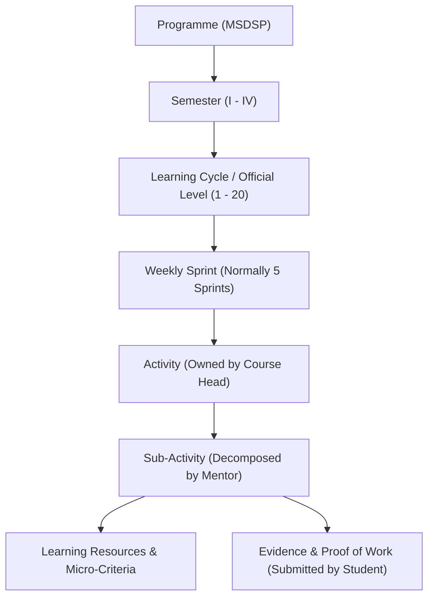

# Activity and Sub-Activity Fields Explanation

**Programme:** M.Sc. Data Science and Product Development (MSDSP)  
**System:** MSDSP Applied Learning Portal  
**Document Type:** Field Reference & Specification  
**Governing Documents:** [`docs/ACTIVITY_AND_SUB_ACTIVITY_WORKFLOW.md`](file:///d:/Sridas%20-%20Old%20Lap/WRKSPC_ANTIGRAVITY/msdsp-portal-v4/docs/ACTIVITY_AND_SUB_ACTIVITY_WORKFLOW.md), [`docs/FULL_STACK_DEVELOPMENT_ACTIVITY_AND_SUB_ACTIVITIES.md`](file:///d:/Sridas%20-%20Old%20Lap/WRKSPC_ANTIGRAVITY/msdsp-portal-v4/docs/FULL_STACK_DEVELOPMENT_ACTIVITY_AND_SUB_ACTIVITIES.md)

---

## 1. Overview and Structural Hierarchy

In the MSDSP framework, learning is structured hierarchically from programme governance down to executable student tasks:

- **Activity (`ACT-xx`)**: An official, course-mapped workplace brief created and governed by the **Course Head**. It defines *what* professional problem needs solving, *which* academic outcomes are targeted, and *how* work will be evaluated.
- **Sub-Activity (`SUB-x.x`)**: An operational, ordered work item created by the **Assigned Mentor**. It decomposes the Activity into concrete, sequential steps with curated resources, dependencies, checkpoints, and specific deliverables.

---

## 2. Activity Fields (Course Head Boundary)

The Activity represents an authentic workplace project slice. Its fields govern the academic validity and client-style requirements.

| Field Name | Type | Owner | Purpose & Description | Allowed Values / Format | Practical Example |
|---|---|---|---|---|---|
| `id` / `assignmentCode` | String | Course Head | Unique identifier for the Activity across the programme. | `ACT-01`, `ACT-02`, etc. | `ACT-01` |
| `title` | String | Course Head | Professional name of the brief or project increment. | Clear, title-case string | *"System Blueprint and API Contract Design"* |
| `semester` | String / Enum | Course Head | Identifies the academic semester. | `Semester I`, `Semester II`, etc. | `Semester II` |
| `level` / `learningCycle` | String / Number | Course Head | Official Level / Learning Cycle mapping. | `LC-01` to `LC-20` (Level 1 to 20) | `LC-09 · Official Level 9` |
| `course` | String | Course Head | Associated credit-bearing academic course(s) and units. | Course code and title | *"Full Stack Integration & Testing"* |
| `bloomLevel` | Enum | Course Head | Target cognitive tier from Bloom’s Revised Taxonomy. | `Analyze`, `Evaluate`, `Create` | `Create` |
| `kolbStage` | Enum | Course Head | Experiential learning stage targeted by this activity. | `Concrete Experience`, `Reflective Observation`, `Abstract Conceptualisation`, `Active Experimentation` | `Concrete Experience` |
| `outcomes` | Array&lt;String&gt; | Course Head | Mapped Programme Outcomes (PO), Programme Specific Outcomes (PSO), and Course Outcomes (CO). | Array of outcome codes | `["PO2", "PO3", "PSO1", "PSO2"]` |
| `problemStatement` / `brief` | Markdown / Text | Course Head | Detailed professional scenario describing client requirements, context, and expected impact. | Multi-paragraph scenario | *"A product team must deliver a working application slice that connects a responsive web client..."* |
| `constraints` | Markdown / Text | Course Head | Technical, architectural, security, or regulatory limitations. | Text / list | *"OpenAPI 3.1 specification, PostgreSQL with Drizzle, WCAG 2.1 AA accessibility."* |
| `assignedMentor` | String / User ID | Course Head | Mentor responsible for decomposing and guiding the activity. | Mentor name / role | *"Student-Team Mentor"* or *"Dr. Jane Doe (Domain Mentor)"* |
| `componentWeight` | String / Number | Course Head | Percentage contribution to the Level’s academic score. | Percentage or weight | `20%` |
| `dueDate` / `submissionDate` | ISO Date / String | Course Head | Official final deadline for all deliverables. | `YYYY-MM-DD` | `2026-10-15` |
| `checkpointDate` | ISO Date / String | Course Head | Mid-point milestone date for progress verification. | `YYYY-MM-DD` | `2026-10-01` |
| `mandatoryDeliverables` | Text / Markdown | Course Head | Mandatory list of artifacts required to clear the evaluation gate. | Bulleted list | *"Versioned repository, openapi.yaml, ER diagram, passing CI run."* |
| `rubricNeedsRevision` | Text | Course Head | Rubric descriptor when submitted work does not meet industry standards. | Criterion text | *"Contract has unresolved type errors or missing error schemas."* |
| `rubricMeetsStandard` | Text | Course Head | Rubric descriptor when submitted work satisfies professional expectations. | Criterion text | *"Valid OpenAPI 3.1 contract, standard RFC 7807 problem details implemented."* |
| `rubricExceedsStandard` | Text | Course Head | Rubric descriptor when work shows exceptional depth or engineering excellence. | Criterion text | *"Comprehensive edge-case validation, automated contract diffs, and security hardening."* |

---

## 3. Sub-Activity Fields (Assigned Mentor Boundary)

Sub-activities break the parent Activity into actionable, chronological engineering steps. They are created and sequenced by the Mentor.

| Field Name | Type | Owner | Purpose & Description | Allowed Values / Format | Practical Example |
|---|---|---|---|---|---|
| `id` | String | Mentor | Unique code identifying the sub-activity and its hierarchy. | `SUB-<ActivityNum>.<StepNum>` | `SUB-1.3` |
| `parentActivityId` | String | System / Mentor | Foreign key linking the sub-activity to its parent `Activity`. | Valid Activity ID | `ACT-01` |
| `title` | String | Mentor | Action-oriented title describing the concrete task. | Concise title string | *"Specify the API contract"* |
| `category` | Enum | Mentor | Pedagogical category defining the nature of the learning interaction. | **13 Categories** (see Category Reference below) | `Assignment` or `Plan` |
| `stepNumber` | Number | Mentor | Chronological position in the 7-step or multi-step progression. | `1` to `N` | `3` |
| `description` | Markdown / Text | Mentor | Clear, actionable instructions telling the student what to do. | Actionable guidance | *"Define versioned endpoints, schemas, validation, pagination, status codes, and RFC 7807 responses."* |
| `deliverable` | String | Mentor | The specific artifact, file, or tangible output expected. | Output description | *"`openapi.yaml` and request/response examples"* |
| `cognitiveLevel` | Enum | Mentor | Cognitive depth required for this individual task. | `Analyze`, `Evaluate`, `Create` | `Create` |
| `outcomes` | Array&lt;String&gt; | Mentor | Subset of outcomes directly practiced in this sub-activity. | Array of codes | `["PSO2", "PO2"]` |
| `ownership` | String | Mentor | Scope of execution (individual learner vs. team role). | `Individual`, `Team`, or Role | `Team (API Lead)` |
| `dependency` | String | Mentor | Prerequisite sub-activity or activity that must finish first. | Sub-activity ID or `None` | `SUB-1.1, SUB-1.2` |
| `checkpoint` | String | Mentor | Milestone description or qualitative condition for sign-off. | Checkpoint title | *"Contract Review Sign-Off"* |
| `checkpointDate` | ISO Date / String | Mentor | Date by which this sub-activity should be submitted for feedback. | `YYYY-MM-DD` | `2026-09-20` |
| `requiresSignoff` | Boolean | Mentor | If `true`, learner cannot proceed to dependent steps without mentor approval. | `true` / `false` | `true` |
| `status` | Enum | System / Student / Mentor | Current execution state of this sub-activity. | `Not Started`, `In progress`, `Submitted`, `Revision`, `Completed` | `In progress` |
| `resources` | Array&lt;`LearningResource`&gt; | Mentor | Curated learning materials, references, and toolkits attached to this task. | Array of objects (see Section 4) | *List of docs, repos, videos* |
| `evaluationCriteria` | Array&lt;`SubTaskEvaluationCriterion`&gt; | Mentor | Specific micro-rubric criteria used to evaluate this sub-activity. | Array of objects (see Section 5) | *Criteria list with 3-tier descriptors* |

---

## 4. Nested Entity: `LearningResource`

Attached directly to a Sub-Activity to support task completion without replacing authentic student work.

| Field Name | Type | Purpose & Description | Example |
|---|---|---|---|
| `id` | String | Unique resource identifier. | `res-101` |
| `title` | String | Human-readable title of the material. | *"OpenAPI 3.1 Specification Guide"* |
| `type` | Enum | Media / format type:  • `Technical Documentation` • `Code Repository / Dataset` • `API Specification` • `Video Demonstration` • `MOOC / Online Course` • `Study PDF` • `Architecture Standard` | `Technical Documentation` |
| `url` | String | Hyperlink or internal repository path to the resource. | `https://spec.openapis.org/oas/v3.1.0` |
| `purpose` | String | Learning objective explaining *why* the student should use this resource. | *"Use to format error schemas compliant with RFC 7807."* |
| `isMandatory` | Boolean | Flags whether reading/viewing is compulsory before submission. | `true` |

---

## 5. Nested Entity: `SubTaskEvaluationCriterion`

Provides transparent micro-rubrics for formative evaluation and revision feedback.

| Field Name | Type | Purpose & Description | Example |
|---|---|---|---|
| `id` | String | Unique identifier for the criterion. | `crit-01` |
| `title` | String | Short name of the evaluated dimension. | *"Schema Completeness & Validation"* |
| `description` | String | Explanation of what is being measured. | *"Measures whether all CRUD endpoints define complete input and output schemas."* |
| `evidenceRequired` | String | Which specific artifact or test proves this criterion. | *"`openapi.yaml` and schema validation report"* |
| `needsRevision` | String | Performance descriptor for substandard or incomplete work. | *"Missing request bodies or undefined 4xx/5xx status codes."* |
| `meetsStandard` | String | Performance descriptor meeting industry standards. | *"All endpoints define request/response schemas and RFC 7807 errors."* |
| `exceedsStandard` | String | Performance descriptor showing advanced mastery. | *"Includes discriminator schemas, examples for every edge case, and contract lint tests."* |
| `weightPercent` | Number | Contribution to the sub-activity or parent rubric. | `25` (representing 25%) |

---

## 6. Sub-Activity Categories & The 7-Step Model

The portal supports two complementary category structures:

### The Core 7-Step Model (Default Student Workflow)
1. **Lecture (Step 1 · Foundations)**: Core theoretical foundations, concept lectures, and background reading.
2. **Quiz (Step 2 · Check)**: Formative knowledge checks testing prerequisite understanding.
3. **Assignment (Step 3 · Practice)**: Focused hands-on exercises and component tasks.
4. **Project (Step 4 · Milestone)**: Main implementation and milestone deliverable.
5. **Review (Step 5 · Critique)**: Code reviews, architectural critiques, and peer evaluations.
6. **Assessment (Step 6 · Defense)**: Final demonstration, technical defense, and panel Q&A.
7. **Improve (Step 7 · Polish)**: Post-review defect resolution, refactoring, and polishing.

### Additional Bloom/Kolb Operational Categories
- **Understand**: Clarifying client briefs, defining requirements, logging assumptions.
- **Plan**: Architecture diagrams, sprint backlogs, ADR preparation.
- **Perform**: Core building, coding, testing, database querying.
- **Record**: Maintaining commit histories, audit logs, experiment records.
- **Demonstrate**: Recording walkthroughs, live demonstrations.
- **Reflect**: Retrospectives and Kolb experiential learning synthesis.

---

## 7. Student-Facing vs. Academic Terminology

To avoid intimidating students with academic jargon while preserving academic rigor, the portal automatically translates technical fields using [`app/student-terminology.ts`](file:///d:/Sridas%20-%20Old%20Lap/WRKSPC_ANTIGRAVITY/msdsp-portal-v4/app/student-terminology.ts):

| Academic / System Field | Student-Facing UI Label | Student Action Meaning |
|---|---|---|
| `problemStatement` / `brief` | **What You Need to Do** | Explains the real-world client task. |
| `mandatoryDeliverables` | **What You Need to Submit** | Exact files, links, or reports required. |
| `evaluationCriteria` / `rubric` | **How Your Work Is Evaluated** | Clear expectations for meeting standards. |
| `kolbStage` | **Learning Approach** | E.g. *"Do the Work"* or *"Review Your Experience"*. |
| `bloomLevel` | **Thinking Skill** | E.g. *"Design and Build"* (`Create`) or *"Analyse the Problem"* (`Analyze`). |
| `evidenceSubmission` | **Proof of Work** | Repository URLs, commits, test logs. |
| `remediation` | **Improvement Plan** | Steps to fix identified defects. |
| `revisionRequired` | **Changes Required** | Mentor feedback indicating needed improvements. |
| `passed` / `completed` | **Approved & Completed** | Milestone successfully cleared. |

---

## 8. Summary Table of Permissions & Responsibilities

| Action | Course Head | Assigned Mentor | Student / Team | Evaluator |
|---|:---:|:---:|:---:|:---:|
| **Create Activity** & set brief | **Accountable / Responsible** | Consulted | Informed | Consulted |
| **Map Outcomes & Academic Weights** | **Accountable / Responsible** | Consulted | Informed | Consulted |
| **Set Official Deadlines** | **Accountable / Responsible** | Consulted | Informed | Consulted |
| **Decompose into Sub-Activities** | Consulted | **Accountable / Responsible** | Informed | Consulted |
| **Attach Learning Resources** | Consulted | **Accountable / Responsible** | Informed | Consulted |
| **Set Checkpoints & Sign-Offs** | Consulted | **Accountable / Responsible** | Informed | Consulted |
| **Perform Work & Submit Evidence** | Informed | Consulted | **Accountable / Responsible** | Informed |
| **Review Evidence & Give Feedback** | Informed | **Accountable / Responsible** | Consulted | Consulted |
| **Recommend Final Grade/Result** | Informed | **Responsible** | Informed | **Accountable** |
| **Publish Academic Progression** | **Accountable / Responsible** | Consulted | Informed | Informed |
